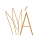
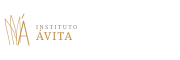
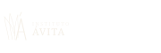

# SPEC — Landing Page Instituto Ávita
**Versão:** 1.0 | **Data:** Junho 2025
**Projeto:** Página de vendas captação WhatsApp | Dr. Diego Leite

---

## 1. VISÃO GERAL E FILOSOFIA DE DESIGN

### Proposta visual
Página que comunica **luxo botânico-natural**: dourado como metal nobre, sage olive como natureza refinada, cream como neutralidade elegante. A estética é a de um instituto premium de estética — não de uma clínica clínica. Cada elemento fala "cuidado personalizado, não processo em massa".

### Público-alvo
Mulheres 30–60 anos, classe AB, que já pensaram em fazer algo no sorriso ou no rosto mas ainda não deram o passo. Estão nas redes sociais, têm bom gosto estético, se importam com autenticidade e naturalidade.

### Intenção de conversão
**Um único CTA ao longo de toda a página:** clicar no botão WhatsApp. Nenhum formulário. Nenhuma complexidade. A página existe para reduzir fricção e construir confiança até o clique.

### Tom visual
Delicado mas confiante. Nunca clínico (sem azul, sem branco frio, sem ícones de dente). Sempre botânico, dourado, natural. A sensação deve ser de uma revista de luxo, não de um site de plano de saúde.

---

## 2. DESIGN TOKENS

### 2.1 Paleta de Cores (extraída da identidade visual oficial)

```css
/* tokens.css */

/* Cores primárias */
--color-gold:      #c19048;   /* Dourado principal — logo, CTAs, acentos */
--color-gold-dark: #a6723e;   /* Dourado escuro — hover de botões, variante */
--color-gold-light:#d4a96a;   /* Dourado claro — gradients, bordas sutis */

/* Fundos */
--color-white:   #ffffff;     /* Seções brancas principais */
--color-cream:   #e8e1d1;     /* Cream — fundo hero, prova social, garantia */
--color-sage:    #81866e;     /* Sage olive — seções de destaque escuras */
--color-forest:  #484e35;     /* Floresta escura — seções mais dramáticas */

/* Textos */
--color-text:       #2c2420;  /* Quase-preto com subtom quente */
--color-text-body:  #4a4540;  /* Corpo de texto — tom médio */
--color-text-muted: #8a837a;  /* Texto secundário, legendas */
--color-text-light: #b8b0a5;  /* Texto muito sutil */
--color-on-dark:    #f5f0e8;  /* Texto em fundos escuros (sage/forest) */
--color-on-dark-muted: rgba(245, 240, 232, 0.7);

/* Acentos de interface */
--color-divider:  rgba(193, 144, 72, 0.2);   /* Linhas divisoras douradas */
--color-overlay:  rgba(44, 36, 32, 0.04);    /* Overlay sutil sobre cream */
```

### 2.2 Tipografia

**Escolha de fontes (Google Fonts):**
- **Display — Cormorant Garamond**: pesos 300, 400, 600. Serif elegante de luxo para headlines. Dá a delicadeza exigida pela identidade visual.
- **Corpo — DM Sans**: pesos 300, 400, 500. Geométrico limpo, leve, moderno. Contrasta com elegância com o Cormorant.
- **Labels/Eyebrows — Josefin Sans**: peso 200, 300. Uppercase ultra-thin. Perfeito para rótulos de seção e micro-textos.

```css
/* Importação Google Fonts — com font-display: swap */
@import url('https://fonts.googleapis.com/css2?family=Cormorant+Garamond:ital,wght@0,300;0,400;0,600;1,300;1,400&family=DM+Sans:wght@300;400;500&family=Josefin+Sans:wght@200;300&display=swap');

--font-display: 'Cormorant Garamond', Georgia, serif;
--font-body:    'DM Sans', system-ui, sans-serif;
--font-label:   'Josefin Sans', Arial, sans-serif;

/* Escala tipográfica */
--text-xs:   0.75rem;    /* 12px — micro-labels */
--text-sm:   0.875rem;   /* 14px — legendas */
--text-base: 1rem;       /* 16px — corpo base */
--text-lg:   1.125rem;   /* 18px — corpo aumentado */
--text-xl:   1.25rem;    /* 20px — destaque de corpo */
--text-2xl:  1.5rem;     /* 24px — lead / intro */
--text-3xl:  1.875rem;   /* 30px — subheadlines */
--text-4xl:  2.5rem;     /* 40px — H2 de seção */
--text-5xl:  3.5rem;     /* 56px — H1 desktop */
--text-6xl:  4.5rem;     /* 72px — H1 hero desktop */
--text-7xl:  6rem;       /* 96px — display dramático */

/* Line-heights */
--leading-tight:  1.1;
--leading-snug:   1.25;
--leading-normal: 1.5;
--leading-relaxed:1.65;
--leading-loose:  1.8;

/* Letter-spacing */
--tracking-label: 0.15em;   /* Josefin Sans em maiúsculo */
--tracking-tight: -0.02em;  /* Headlines grandes */
--tracking-normal: 0;
```

### 2.3 Espaçamento

```css
--space-1:  0.25rem;   /* 4px */
--space-2:  0.5rem;    /* 8px */
--space-3:  0.75rem;   /* 12px */
--space-4:  1rem;      /* 16px */
--space-5:  1.25rem;   /* 20px */
--space-6:  1.5rem;    /* 24px */
--space-8:  2rem;      /* 32px */
--space-10: 2.5rem;    /* 40px */
--space-12: 3rem;      /* 48px */
--space-16: 4rem;      /* 64px */
--space-20: 5rem;      /* 80px */
--space-24: 6rem;      /* 96px */
--space-32: 8rem;      /* 128px */

/* Padding de seção */
--section-py-sm: 4rem;    /* 64px — seções menores */
--section-py:    6rem;    /* 96px — seções padrão */
--section-py-lg: 8rem;    /* 128px — seções hero/CTA */
```

### 2.4 Sombras e Bordas

```css
--shadow-sm:  0 1px 3px rgba(44, 36, 32, 0.06), 0 1px 2px rgba(44, 36, 32, 0.04);
--shadow-md:  0 4px 16px rgba(44, 36, 32, 0.08), 0 2px 8px rgba(44, 36, 32, 0.05);
--shadow-lg:  0 12px 40px rgba(44, 36, 32, 0.12), 0 4px 16px rgba(44, 36, 32, 0.06);
--shadow-gold: 0 4px 20px rgba(193, 144, 72, 0.25);

--radius-sm:  2px;
--radius-md:  4px;   /* Máximo usado — marca delicada, sem bordas grandes */
--radius-pill: 100px; /* Apenas para badges de prova social */
```

### 2.5 Transições

```css
--transition-fast:   150ms cubic-bezier(0.4, 0, 0.2, 1);
--transition-base:   300ms cubic-bezier(0.4, 0, 0.2, 1);
--transition-slow:   500ms cubic-bezier(0.4, 0, 0.2, 1);
--transition-spring: 400ms cubic-bezier(0.34, 1.56, 0.64, 1);
```

---

## 3. ELEMENTO ASSINATURA — Ornamento Botânico

O **motivo folha** da identidade visual é o elemento que torna esta página reconhecível. Deve aparecer como:

1. **SVG decorativo de fundo** em 3–4 seções, posicionado `position: absolute` nos cantos (normalmente inferior-direito ou superior-esquerdo), com `opacity: 0.07–0.15`, sem interagir com o layout.
2. **Divisor de seções** — em vez de `<hr>`, usar um ornamento dourado centralizado (folha estilizada pequena + linha) entre alguns blocos.
3. **Barra de progresso de leitura** no topo da página — linha dourada fina (3px), `position: fixed`, que cresce de 0 a 100% conforme o usuário rola.

**O motivo folha em SVG (simplificado para inline):**
```svg
<!-- Isotipo simplificado — folhas + Á -->
<svg viewBox="0 0 120 100" fill="none" xmlns="http://www.w3.org/2000/svg">
  <!-- Grupo de folhas -->
  <path d="M35,85 C30,60 20,45 15,20 C25,35 40,48 45,70" 
        stroke="currentColor" stroke-width="1.2" fill="none"/>
  <path d="M45,85 C38,58 32,40 35,12 C42,32 52,52 50,75" 
        stroke="currentColor" stroke-width="1.2" fill="none"/>
  <path d="M50,85 C48,62 50,40 60,15 C58,38 62,60 58,80" 
        stroke="currentColor" stroke-width="1" fill="none"/>
  <!-- Á estilizado -->
  <path d="M55,85 L72,25 L89,85" stroke="currentColor" stroke-width="2.5" fill="none" stroke-linecap="round"/>
  <!-- Acento -->
  <path d="M68,18 L74,8" stroke="currentColor" stroke-width="2" stroke-linecap="round"/>
</svg>
```

---

## 4. SCROLLBAR CUSTOMIZADA

```css
/* Apenas Webkit (Chrome, Edge, Safari) */
::-webkit-scrollbar { width: 6px; }
::-webkit-scrollbar-track { background: var(--color-cream); }
::-webkit-scrollbar-thumb { 
  background: var(--color-gold); 
  border-radius: 3px; 
}
::-webkit-scrollbar-thumb:hover { background: var(--color-gold-dark); }

/* Firefox */
* { scrollbar-width: thin; scrollbar-color: var(--color-gold) var(--color-cream); }
```

---

## 5. ARQUITETURA DE SEÇÕES

### Mapa completo (14 componentes para os 15 blocos de copy)

```
┌─────────────────────────────────────────────────────┐
│  NAV — sticky, mínima, isotipo + CTA mobile         │
├─────────────────────────────────────────────────────┤
│  HERO — fundo cream, headline split 3 linhas,       │
│         subheadline, CTA primário                   │
│         [blocos 1 + 2 + 4]                          │
├─────────────────────────────────────────────────────┤
│  ABERTURA — fundo branco, texto largo centrado,     │
│             badge "+500"                            │
│             [bloco 3]                               │
├─────────────────────────────────────────────────────┤
│  DOR — fundo branco, 6 itens em grid com ícone,    │
│         entrada stagger da esquerda                 │
│         [bloco 5]                                   │
├─────────────────────────────────────────────────────┤
│  SOLUÇÃO — fundo SAGE (#81866e), texto branco +    │
│            dourado, ornamento botânico              │
│            [bloco 6]                                │
├─────────────────────────────────────────────────────┤
│  BENEFÍCIOS — fundo branco, 6 cards em grid 3x2,   │
│               hover com border reveal dourada       │
│               [bloco 7]                             │
├─────────────────────────────────────────────────────┤
│  PROVA SOCIAL — fundo CREAM (#e8e1d1), contador    │
│                 +500, 3 cards depoimento, placeholders│
│                 [bloco 8]                           │
├─────────────────────────────────────────────────────┤
│  OFERTA — fundo FOREST (#484e35), 3 pilares em     │
│            cards dourados sobre escuro              │
│            [bloco 9]                                │
├─────────────────────────────────────────────────────┤
│  OBJEÇÕES — fundo branco, 5 itens accordion        │
│              [bloco 10]                             │
├─────────────────────────────────────────────────────┤
│  GARANTIA — fundo CREAM (#e8e1d1), texto centrado, │
│              ícone cadeado dourado                  │
│              [bloco 11]                             │
├─────────────────────────────────────────────────────┤
│  URGÊNCIA — fundo SAGE (#81866e), texto impactante │
│              + CTA                                  │
│              [bloco 12]                             │
├─────────────────────────────────────────────────────┤
│  FAQ — fundo branco, 7 acordeons               │
│         [bloco 13]                                  │
├─────────────────────────────────────────────────────┤
│  CTA FINAL — fundo FOREST (#484e35), tipografia   │
│               grande, copy completo bloco 14       │
│               [bloco 14]                            │
├─────────────────────────────────────────────────────┤
│  PS — fundo branco, texto pequeno, CTA final       │
│        [bloco 15]                                   │
├─────────────────────────────────────────────────────┤
│  FOOTER — fundo forest, logo completa branca,      │
│            links mínimos                            │
└─────────────────────────────────────────────────────┘
```

---

## 6. SPECS DE COMPONENTES

### 6.1 NAV (Navegação Fixa)

**Fundo:** `rgba(255, 255, 255, 0.96)` com `backdrop-filter: blur(8px)`
**Altura:** 72px desktop / 60px mobile
**Borda inferior:** `1px solid var(--color-divider)`
**Transição:** ao scrollar mais de 80px, adicionar `box-shadow: var(--shadow-sm)`

**Conteúdo:**
- Esquerda: Isotipo SVG (placeholder `assets/images/logo-isotipo.svg`) — 44px altura
- Direita desktop: Botão CTA WhatsApp pequeno
- Mobile: Botão hamburger → menu drawer com CTA

**CTA da nav:**
```
[⟶ Agendar pelo WhatsApp]
```
- Fundo: `var(--color-gold)`
- Texto: white, Josefin Sans 200, uppercase, tracking largo
- Padding: `10px 20px`
- Border-radius: `var(--radius-md)` (4px)
- Hover: `var(--color-gold-dark)`, seta desliza 4px para direita

---

### 6.2 HERO

**Fundo:** `var(--color-cream)` — `#e8e1d1`
**Altura mínima:** `100svh`
**Layout:** flex coluna, centrado verticalmente, padding lateral `max(5vw, 1.5rem)`

**Conteúdo:**
1. Eyebrow label (Josefin Sans 200, uppercase, tracking `0.15em`, `var(--color-gold)`, `var(--text-sm)`)  
   Texto: `Reabilitação Oral & Harmonização Orofacial`

2. Headline (Cormorant Garamond 400 → italic no 3º verso)  
   Variação C — split em 3 linhas:
   ```
   "Seu Sorriso e Seu Rosto"        ← linha 1, font-size: clamp(2.5rem, 6vw, 5rem)
   "Merecem Estar em Harmonia."      ← linha 2
   "No Instituto Ávita, Isso Acontece." ← linha 3, em itálico, ligeiramente menor
   ```
   Cada linha entra com `translateY(40px) → 0` e `opacity: 0 → 1` em sequência (stagger 150ms por linha)
   
3. Subheadline (DM Sans 300, `var(--text-xl)`, `var(--color-text-body)`, max-width 640px)
   Texto exato do bloco 2.

4. CTA Botão — ver spec de botão abaixo

5. Três micro-badges abaixo do botão (DM Sans 300, `var(--text-sm)`, `var(--color-text-muted)`):
   `Sem compromisso · Atendimento personalizado · Resposta rápida pelo WhatsApp`

**Ornamento:** Folha SVG bottom-right, `position: absolute`, `opacity: 0.12`, `width: clamp(200px, 30vw, 400px)`, com transform parallax leve (scroll Y / -5)

**Divisor para próxima seção:** clip-path diagonal `polygon(0 0, 100% 0, 100% 90%, 0 100%)` no próprio section — cria a transição inclinada para o branco

---

### 6.3 ABERTURA / PROPOSTA DE VALOR

**Fundo:** `var(--color-white)`
**Padding vertical:** `var(--section-py)` (96px)
**Layout:** coluna centrada, `max-width: 780px`, `margin: 0 auto`

**Conteúdo:**
1. Ornamento divisor dourado centralizado (linha `1px solid var(--color-gold)` de 60px + folhinha SVG ao centro)
2. Texto completo do bloco 3 em DM Sans 300, `var(--text-lg)`, `var(--leading-relaxed)`
3. Badge "+500 sorrisos transformados" — pill dourado com texto Josefin Sans

**Animação:** Parágrafo entra `translateY(30px) → 0` ao entrar no viewport

---

### 6.4 DOR — "Você já se sentiu assim?"

**Fundo:** `var(--color-white)`
**Padding vertical:** `var(--section-py)`

**Layout:**
```
┌──────────────────────────────────────────────┐
│  VOCÊ JÁ SE SENTIU ASSIM?                    │
│  (eyebrow label dourado centrado)            │
│                                              │
│  ┌─────────────────┐  ┌─────────────────┐   │
│  │ ◇ item dor 1    │  │ ◇ item dor 2    │   │
│  └─────────────────┘  └─────────────────┘   │
│  ┌─────────────────┐  ┌─────────────────┐   │
│  │ ◇ item dor 3    │  │ ◇ item dor 4    │   │
│  └─────────────────┘  └─────────────────┘   │
│  ┌─────────────────┐  ┌─────────────────┐   │
│  │ ◇ item dor 5    │  │ ◇ item dor 6    │   │
│  └─────────────────┘  └─────────────────┘   │
│                                              │
│  "Se algum desses pontos tocou algo..."      │
│  [CTA — uma conversa]                        │
└──────────────────────────────────────────────┘
```

**Cada item dor:**
- Ícone: `◇` em dourado (ou leaf SVG 16px)
- Texto: DM Sans 400, `var(--text-base)`, `var(--leading-relaxed)`
- Borda: `1px solid var(--color-divider)`, padding `1.5rem`
- Hover: borda vira `var(--color-gold)`, sombra sutil

**Animação:** Cada card entra da esquerda com delay progressivo (0ms, 100ms, 200ms, 300ms, 400ms, 500ms)

**Chamada final:** "Se algum desses pontos tocou algo em você: isso tem solução. E ela começa com uma conversa." — centrado, DM Sans 300 italic, `var(--text-lg)`, max-width 560px

---

### 6.5 SOLUÇÃO

**Fundo:** `var(--color-sage)` — `#81866e`
**Padding vertical:** `var(--section-py-lg)` (128px)

**Layout:** 2 colunas (texto 60% | ornamento decorativo 40%)
- Mobile: coluna única

**Conteúdo esquerda:**
1. Eyebrow: "A diferença Ávita" (Josefin Sans 200, `var(--color-on-dark-muted)`)
2. H2 (Cormorant Garamond 400 italic, `var(--color-on-dark)`, `clamp(2rem, 4vw, 3.5rem)`)
3. Parágrafo do bloco 6 (DM Sans 300, `var(--color-on-dark-muted)`, `var(--text-lg)`)
4. CTA botão versão invertida (fundo dourado, texto branco)

**Ornamento direita:**
- Folha SVG grande, `color: var(--color-gold)`, `opacity: 0.25`, com parallax leve

---

### 6.6 BENEFÍCIOS

**Fundo:** `var(--color-white)`
**Padding vertical:** `var(--section-py)`

**Layout:**
- H2 centrado
- Grid 3 colunas desktop / 2 tablet / 1 mobile

**Cada card benefício:**
```
┌─────────────────────────┐
│                         │
│  [ornamento Á dourado]  │  ← isotipo 32px
│                         │
│  Você vai voltar a      │  ← DM Sans 500 (título)
│  sorrir abertamente     │
│                         │
│  Texto descritivo...    │  ← DM Sans 300
│                         │
└─────────────────────────┘
```
- Padding: `2rem`
- Borda: `1px solid transparent`
- Hover: `border-color: var(--color-gold)`, `box-shadow: var(--shadow-gold)`, transform `translateY(-4px)`
- Transição: `var(--transition-base)`

**Animação:** Cards entram com stagger de 80ms cada

---

### 6.7 PROVA SOCIAL

**Fundo:** `var(--color-cream)` — `#e8e1d1`
**Padding vertical:** `var(--section-py)`

**Conteúdo:**
1. Eyebrow + badge dourado: `★ +500 sorrisos transformados`
   - Contador animado: quando entra no viewport, conta de 0 até 500 em 2s com easing
2. Rating placeholder: `★★★★★ [avaliações Google]` — estilo badge pill
3. Grid 3 depoimentos (cards com sombra suave, fundo branco)
4. Placeholders para fotos antes/depois e logos de mídia

**Card depoimento:**
```
┌─────────────────────────┐
│  ★★★★★                  │
│                         │
│  "Passei anos evitando  │
│   sorrir em fotos..."   │
│                         │
│  — [Nome], [Cidade]     │
│    [Tipo de tratamento] │
└─────────────────────────┘
```
- Fundo: white
- Sombra: `var(--shadow-md)`
- Borda-top: `3px solid var(--color-gold)`
- Border-radius: `var(--radius-md)`

---

### 6.8 OFERTA

**Fundo:** `var(--color-forest)` — `#484e35`
**Padding vertical:** `var(--section-py-lg)`

**Layout:**
1. H2 em Cormorant Garamond, cor `var(--color-on-dark)` (cream)
2. Subtexto introdutório
3. Grid 3 pilares (Reabilitação | HOF | Diferencial)
4. CTA botão dourado

**Cada pilar:**
```
┌─────────────────────────┐
│  🦷 REABILITAÇÃO ORAL   │  ← Josefin Sans 200 + emoji/ícone
│  ─────────────────      │  ← linha dourada 40px
│                         │
│  Texto descritivo...    │  ← DM Sans 300, cor on-dark-muted
│                         │
│  ✓ item                 │  ← checkmark dourado, DM Sans 400
│  ✓ item                 │
│  ✓ item                 │
└─────────────────────────┘
```
- Borda: `1px solid rgba(193, 144, 72, 0.3)`
- Background: `rgba(255, 255, 255, 0.04)`
- Hover: borda vira `var(--color-gold)`, fundo `rgba(193, 144, 72, 0.06)`

---

### 6.9 OBJEÇÕES

**Fundo:** `var(--color-white)`
**Padding vertical:** `var(--section-py)`

**Layout:** Coluna única, `max-width: 720px`, centrado

**Accordion (5 itens):**
- Cada pergunta: DM Sans 500, `var(--text-lg)`, com `▸` ou `+` dourado à esquerda
- Ao abrir: ícone gira 90°, resposta expande com `max-height` animada suavemente
- Animação height: `max-height: 0 → max-height: 600px` com `overflow: hidden`
- Borda inferior: `1px solid var(--color-divider)`
- Resposta: DM Sans 300, `var(--text-base)`, `var(--color-text-body)`

---

### 6.10 GARANTIA

**Fundo:** `var(--color-cream)`
**Padding vertical:** `var(--section-py-sm)` (64px)
**Layout:** Centrado, `max-width: 600px`

**Conteúdo:**
- Ícone cadeado em SVG (stroke dourado, sem preenchimento, 48px)
- H3 (Cormorant Garamond 400 italic): "Nosso compromisso é com o seu resultado"
- Texto do bloco 11
- Nota: placeholder para política de garantia oficial

---

### 6.11 URGÊNCIA

**Fundo:** `var(--color-sage)` — `#81866e`
**Padding vertical:** `var(--section-py)` (96px)
**Layout:** Centrado, dramático

**Conteúdo:**
1. Ornamento folha dourado — pequeno, centrado no topo
2. Texto do bloco 12 (copy da sugestão com vagas limitadas)
3. CTA botão dourado grande

**Tipografia:** Cormorant Garamond 300, `var(--color-on-dark)`, `clamp(1.5rem, 3vw, 2.5rem)`, centrado, `var(--leading-snug)`

---

### 6.12 FAQ

**Fundo:** `var(--color-white)`
**Padding vertical:** `var(--section-py)`
**Layout:** Coluna única, `max-width: 720px`, centrado

**7 itens accordion** — mesma spec do componente accordion de objeções.

---

### 6.13 CTA FINAL

**Fundo:** `var(--color-forest)` — `#484e35`
**Padding vertical:** `var(--section-py-lg)` (128px)
**Layout:** Centrado, dramático, typographically-led

**Conteúdo (bloco 14):**
1. Ornamento folha SVG grande como pano de fundo (opacity 0.08)
2. "Você leu até aqui." — Cormorant Garamond 600 italic, `clamp(2rem, 5vw, 4rem)`, `var(--color-gold)`
3. Texto do parágrafo principal — DM Sans 300, `var(--color-on-dark-muted)`, `var(--text-xl)`
4. Badge "+500 pacientes já deram esse primeiro passo. Seja o próximo." — destaque dourado
5. CTA botão grande (dourado, `var(--text-lg)`, padding generoso)
6. Micro-texto abaixo: "Atendimento pelo WhatsApp · Resposta rápida · Avaliação personalizada"

---

### 6.14 PS

**Fundo:** `var(--color-white)`
**Padding:** `var(--section-py-sm)`
**Layout:** Centrado, `max-width: 640px`

**Conteúdo:**
- Ornamento divisor central dourado
- Texto do bloco 15 — DM Sans 300, `var(--text-base)`, `var(--color-text-body)`, centrado
- CTA final pequeno: `[AGENDAR MINHA AVALIAÇÃO PELO WHATSAPP →]`

---

### 6.15 FOOTER

**Fundo:** `var(--color-forest)` — `#484e35`
**Padding:** `3rem`
**Layout:** Flex, space-between, alinha-center

**Conteúdo:**
- Logo completa (placeholder `assets/images/logo-completa.svg`) — versão branca/cream, 120px altura
- Texto: "© 2025 Instituto Ávita — Dr. Diego Leite | CRO6928 | CRO14712" — DM Sans 300, `var(--text-sm)`, `var(--color-on-dark-muted)`
- Links mínimos: WhatsApp | Instagram

---

## 7. SPEC DO BOTÃO CTA

**Um único design de botão, 2 variações:**

### Variação Principal (fundo dourado)
```
background:    var(--color-gold)
color:         white
font-family:   var(--font-label)
font-weight:   300
text-transform: uppercase
letter-spacing: var(--tracking-label)
font-size:     var(--text-sm)
padding:       16px 32px
border-radius: var(--radius-md)
border:        none
cursor:        pointer
display:       inline-flex
align-items:   center
gap:           10px
```

**Pseudo-elemento arrow:** `::after { content: '→' }` que em hover faz `transform: translateX(6px)`

**Hover state:**
```
background:   var(--color-gold-dark)
box-shadow:   var(--shadow-gold)
transform:    translateY(-1px)
```

**Active state:**
```
transform:    translateY(0)
box-shadow:   none
```

### Variação Invertida (para fundos escuros — sage/forest)
Mesma estrutura, mas:
```
background:   transparent
color:        var(--color-gold)
border:       1px solid var(--color-gold)
```
Hover: `background: var(--color-gold)`, `color: white`

---

## 8. SPEC DE ANIMAÇÕES

### 8.1 Intersection Observer — Entrada de Seções

```js
// animations.js
const observerOptions = {
  threshold: 0.15,
  rootMargin: '0px 0px -60px 0px'
};

// Classes CSS base (pré-animação):
.reveal {
  opacity: 0;
  transform: translateY(32px);
  transition: opacity 600ms cubic-bezier(0.4, 0, 0.2, 1),
              transform 600ms cubic-bezier(0.4, 0, 0.2, 1);
}

.reveal.revealed {
  opacity: 1;
  transform: translateY(0);
}

// Stagger via custom property:
.reveal[data-delay="1"] { transition-delay: 100ms; }
.reveal[data-delay="2"] { transition-delay: 200ms; }
.reveal[data-delay="3"] { transition-delay: 300ms; }
.reveal[data-delay="4"] { transition-delay: 400ms; }
.reveal[data-delay="5"] { transition-delay: 500ms; }
.reveal[data-delay="6"] { transition-delay: 600ms; }
```

### 8.2 Split Text Hero

```js
// O texto da headline é dividido em spans por linha
// Cada span entra em sequência com 200ms delay entre linhas
// Usando CSS + JS sem biblioteca externa
```

### 8.3 Contador Animado (+500)

```js
// animations.js — triggerCounter()
// Ao entrar no viewport pela primeira vez:
// - Conta de 0 a 500 em 2000ms
// - Easing: easeOutExpo
// - Formato: "+" + Math.floor(progress * 500)
```

### 8.4 Parallax Botânico

```js
// ui.js — handleParallax()
// requestAnimationFrame para suavidade
// Elementos .parallax-leaf: transform translateY(scrollY * factor)
// factor típico: -0.08 a -0.15 (move menos que o scroll)
// Usar will-change: transform (aplicar somente a esses elementos)
```

### 8.5 Barra de Progresso de Leitura

```js
// ui.js — updateProgressBar()
// #reading-progress: position fixed, top 0, height 3px, background gold
// width = (scrollY / (documentHeight - viewportHeight)) * 100 + '%'
```

### 8.6 Accordion (Objeções + FAQ)

```js
// ui.js — initAccordion()
// Max-height: 0 → conteúdo real em altura px
// Medir altura com getBoundingClientRect(), guardar no dataset
// Transição: max-height 350ms ease, padding 350ms ease
```

### 8.7 Scroll Suave (Smooth Scroll)

```js
// base.css: html { scroll-behavior: smooth; }
// Para navegadores que não suportam: polyfill via JS nativo no main.js
// Anchors #section-X para eventuais links internos
```

### 8.8 Respeitar prefers-reduced-motion

```css
/* animations.css */
@media (prefers-reduced-motion: reduce) {
  .reveal {
    opacity: 1;
    transform: none;
    transition: none;
  }
  .parallax-leaf { transform: none !important; }
  * { animation-duration: 0.01ms !important; }
}
```

---

## 9. RESPONSIVIDADE

### Breakpoints

```css
/* tokens.css */
--breakpoint-sm:  480px;
--breakpoint-md:  768px;
--breakpoint-lg:  1024px;
--breakpoint-xl:  1280px;
--breakpoint-2xl: 1440px;
```

### Grid System

```css
/* Container */
.container {
  width: 100%;
  max-width: 1200px;
  margin: 0 auto;
  padding: 0 clamp(1.5rem, 5vw, 4rem);
}
```

### Comportamento Mobile

- Nav: isotipo centralizado, menu hamburger direita, sem CTA texto (apenas ícone WhatsApp)
- Hero: headline `clamp(2rem, 8vw, 5rem)`, texto centrado
- Grid Dor: 1 coluna
- Grid Benefícios: 1 coluna
- Grid Oferta: 1 coluna
- Cards Depoimentos: 1 coluna com scroll horizontal
- Scrollbar customizada: desativada no mobile (não visível)

---

## 10. OTIMIZAÇÃO PAGESPEED

### 10.1 CSS Crítico (Critical Path)

O `index.html` deve conter inline no `<head>` os estilos críticos para renderização above-the-fold:
- Reset mínimo
- Variáveis CSS (tokens)
- Estilos do `<body>`, nav e hero
- Font-face declarations

O restante dos CSS é carregado com:
```html
<link rel="stylesheet" href="css/layout.css" media="print" onload="this.media='all'">
```

### 10.2 Google Fonts

```html
<link rel="preconnect" href="https://fonts.googleapis.com">
<link rel="preconnect" href="https://fonts.gstatic.com" crossorigin>
<link href="https://fonts.googleapis.com/css2?family=Cormorant+Garamond:ital,wght@0,300;0,400;0,600;1,300;1,400&family=DM+Sans:wght@300;400;500&family=Josefin+Sans:wght@200;300&display=swap" rel="stylesheet">
```

### 10.3 Imagens

Todos os ``:
```html

```

- Logo nos `assets/images/` devem ser SVG (vetor, sem peso)
- Fotos de antes/depois: WebP com fallback JPEG
- Sem imagens de fundo em CSS (usar `` + `object-fit: cover` quando possível para lazy loading)

### 10.4 JavaScript

```html
<script src="js/main.js" defer></script>
<script src="js/animations.js" defer></script>
<script src="js/ui.js" defer></script>
```

- Nenhuma biblioteca externa (zero deps)
- Event listeners passivos para scroll: `{ passive: true }`
- Debounce no resize handler
- IntersectionObserver nativo (não usar scroll listener para animações)

### 10.5 Meta e SEO

```html
<meta charset="UTF-8">
<meta name="viewport" content="width=device-width, initial-scale=1.0">
<meta name="description" content="Instituto Ávita — Reabilitação Oral e Estética com Dr. Diego Leite. Sorriso e harmonização orofacial em planejamento integrado. Agende sua avaliação.">
<title>Instituto Ávita | Reabilitação Oral e Estética — Dr. Diego Leite</title>

<!-- Open Graph (para compartilhamento) -->
<meta property="og:title" content="Instituto Ávita | Reabilitação Oral e Estética">
<meta property="og:description" content="Mais de 500 sorrisos transformados. Reabilitação Oral e Harmonização Orofacial integradas. Agende sua avaliação.">
<meta property="og:type" content="website">

<!-- Structured Data (JSON-LD) -->
<script type="application/ld+json">
{
  "@context": "https://schema.org",
  "@type": "Dentist",
  "name": "Instituto Ávita",
  "description": "Reabilitação Oral e Estética com Dr. Diego Leite",
  "telephone": "+5585998119223"
}
</script>
```

### 10.6 Regras de Performance

- Sem `@import` em CSS (usar `<link>` no HTML)
- Sem `document.write()`
- Sem layout thrashing (ler DOM antes de escrever em batch)
- `will-change: transform` apenas em elementos com parallax ativo
- Remover `will-change` após a animação se possível

---

## 11. PLACEHOLDERS DE LOGO

**Nav — Isotipo:**
```html
<!-- SUBSTITUIR: Colocar aqui o arquivo assets/images/logo-isotipo.svg -->

```

**Seções com fundo claro — Logo completa dourada:**
```html
<!-- SUBSTITUIR: Colocar aqui o arquivo assets/images/logo-completa.svg -->

```

**Seções com fundo escuro — Logo completa branca:**
```html
<!-- SUBSTITUIR: Colocar aqui o arquivo assets/images/logo-completa-branca.svg -->

```

Enquanto os SVGs reais não são inseridos, usar um placeholder div visualmente:
```html
<div class="logo-placeholder" aria-label="Instituto Ávita">
  <!-- Placeholder visual até logo real ser inserida -->
</div>
```

---

## 12. LINK DO CTA (WHATSAPP)

Todas as instâncias de botão CTA apontam para:

```
https://l.instagram.com/?u=https%3A%2F%2Fapi.whatsapp.com%2Fsend%3Fphone%3D5585998119223%26text%3DOl%2525C3%2525A1%25252C%252520gostaria%252520de%252520marcar%252520minha%252520consulta%252521%26utm_source%3Dig%26utm_medium%3Dsocial%26utm_content%3Dlink_in_bio%26fbclid%3DPAZXh0bgNhZW0CMTEAc3J0YwZhcHBfaWQPOTM2NjE5NzQzMzkyNDU5AAGnmtaloL-Xft2s-PIMGlLFGK2qnugMWEYR_L-hrNktaCjH3w6dO9GDxqN2eUc_aem_xAzyyD5NPygzf-eykj0PtQ&e=AUBriN79TZKHfBZq8PAMk9-vmvmrBHg1MdvnrQQg5mbIinRcT1mdfl0qUArWGEULu3yYax2OkxJ7DkpZlO2VzRvoUc54e-LAreZzjwymzh0SDFKBbjxjhGmtGwr3Xs81OThor9HrCyz30GxIz6qIIUs
```

Atributos obrigatórios em todos os botões:
```html
target="_blank" rel="noopener noreferrer"
```

---

## 13. CHECKLIST FINAL PRÉ-ENTREGA

### HTML
- [ ] Semântico: `<header>`, `<main>`, `<section>`, `<footer>`, `<nav>`
- [ ] Cada seção com `id` descritivo
- [ ] `lang="pt-BR"` no `<html>`
- [ ] Todos os `` com `alt`, `width`, `height`, `loading="lazy"` (exceto hero above-fold)
- [ ] JSON-LD estruturado
- [ ] Meta description e OG tags

### CSS
- [ ] Zero valores hardcoded — tudo via CSS variables
- [ ] Sem conflito de especificidade (cuidado com `.section p` vs `.hero__text`)
- [ ] Media queries mobile-first
- [ ] `prefers-reduced-motion` implementado
- [ ] Scrollbar customizada
- [ ] Sem `!important` (exceto no reset e reduced-motion)

### JS
- [ ] Todos os scripts com `defer`
- [ ] Scroll listeners com `{ passive: true }`
- [ ] IntersectionObserver para todas as animações
- [ ] Accordion funcional (objeções + FAQ)
- [ ] Contador animado (+500)
- [ ] Parallax suave
- [ ] Barra de progresso de leitura

### Performance
- [ ] Google Fonts com `preconnect` + `font-display: swap`
- [ ] CSS crítico inline no `<head>`
- [ ] CSS não-crítico com loading assíncrono
- [ ] JS com `defer`
- [ ] Imagens com `loading="lazy"` (exceto hero)
